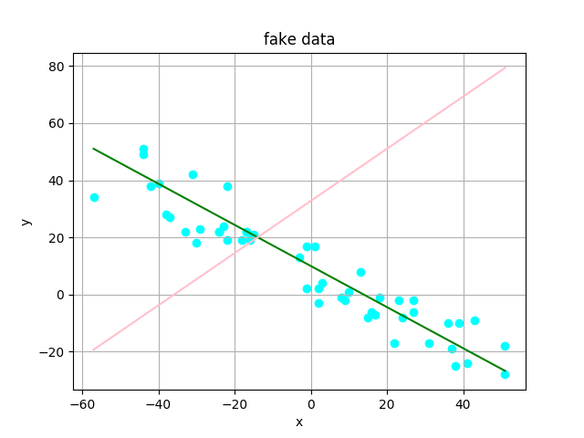
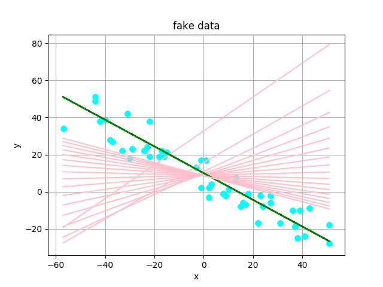
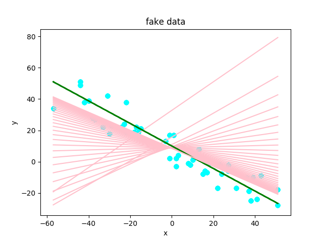

# Univariate-Linear-Regression-in-Numpy
This is an implementation of Univariate Linear Regression from scratch in Python using Numpy.

## Dependencies
* numpy
* matplotlib

## Results
* ### @Epoch = 0
  

* ### @Epoch = 400
  

* ### @Epoch = 725
  
